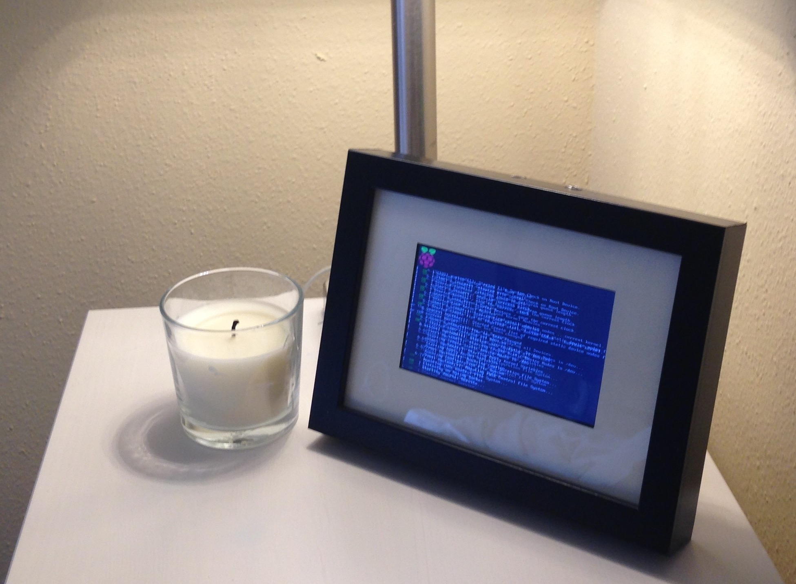
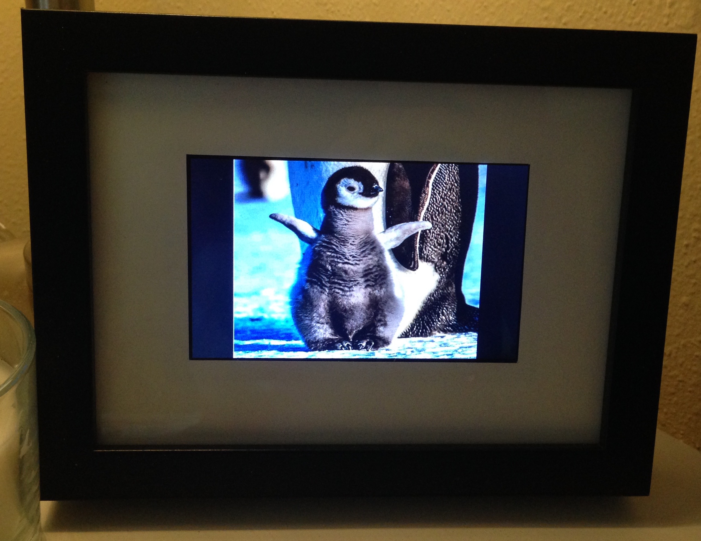
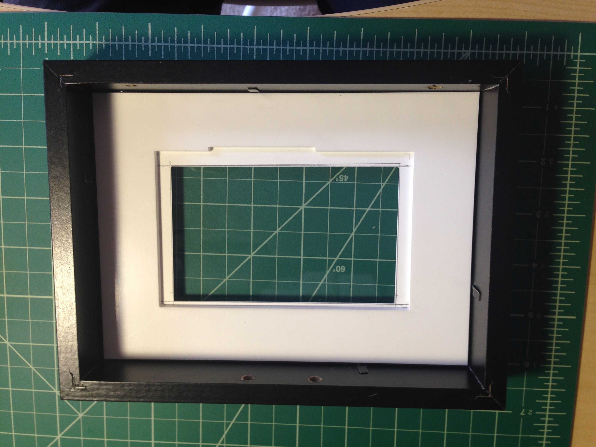
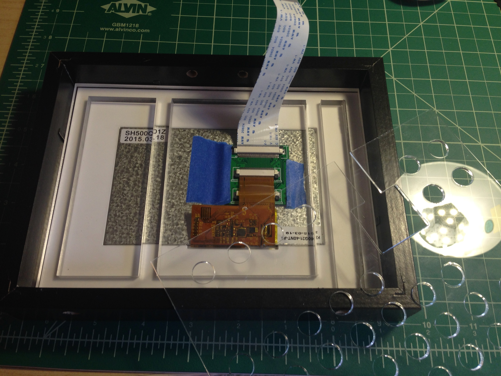
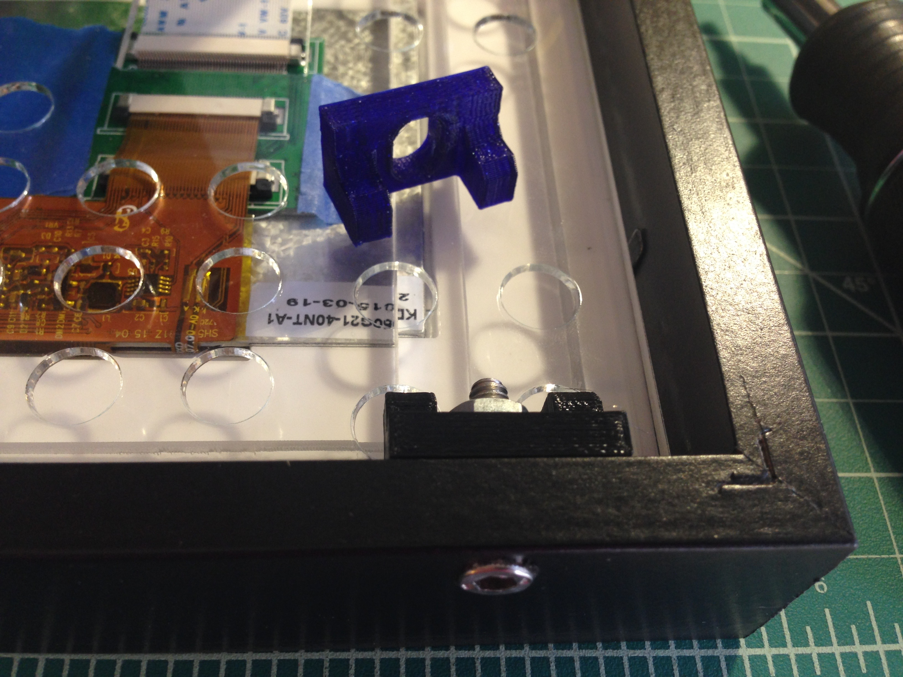
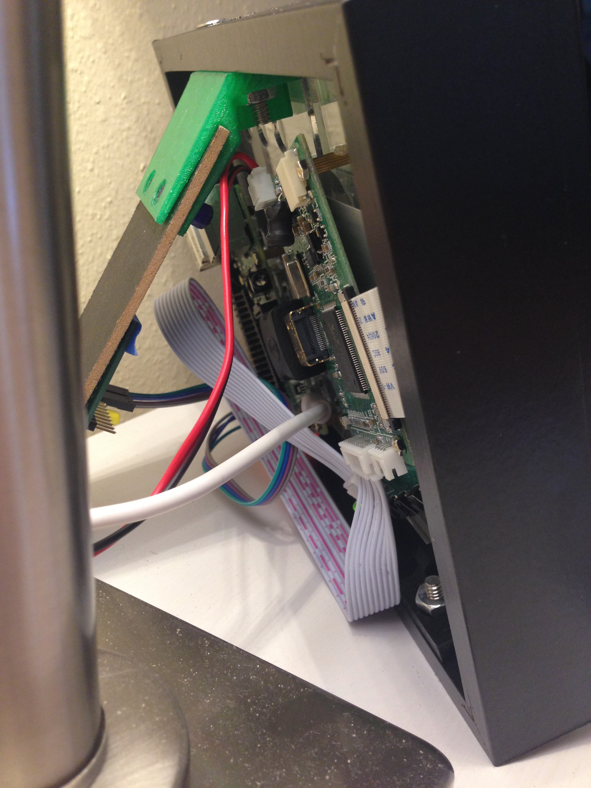

# PiSlideshow

>A Raspberry Pi powered smart photo frame / slide show. Anyone can upload photos using Balloon.io, which are added to the display and cycled using FBI

<p align="center">
  
</p>
<p align="center">
  
</p>

## How it works

Balloon.io allows you to setup a website where anyone can upload images that are placed into the Apps folder of the linked Dropbox account, which works on mobile and desktop. The app pulls all images from the set Dropbox folder and loads them locally. Once completely downloaded, the FBI task is started to update the image at short time intervals. There is additional logic to handle stopping and starting the FBI task to keep the display always up to date as new photos are downloaded and added to the cycle.

The photo frame can additionally be turned on and off. I wired a GPIO pin to the display controller that toggles the display state from on in the afternoon and off at night.

## The hardware

I modified an IKEA frame to hold a small TFT display with space for airflow and mounting point for the Raspberry Pi and driver board. I stacked a piece of thick white paper for a crisp edge around the display then three pieces of laser cut acrylic. The first piece holds the display, the second provides space for the ribbon cable, and the third has air holes for circulation and is the surface that the boards are mounted to with standoffs

<p align="center">
  
</p>
<p align="center">Laser Cut Base Layer / Display Support</p>

<p align="center">
  
</p>
<p align="center">Additional laser cut stacked layers</p>

Three 3D printed feet hold everything sandwiched in place along with the original stand for support. Just on the inside surface of the stand is a small perf board with an indicator LED and pushbutton. The pushbutton allows for manual updates of the display

<p align="center">
  
</p>
<p align="center">3D Printed Feet</p>

<p align="center">
  
</p>
<p align="center">Full assembly</p>

## How to run your own version

<!-- FIXME -->

*(TODO) I'm currently migrating to Dropbox v2 authentication, which is a major change, so open up an issue and I'll make sure to let you know my current progress*

<!-- [](https://balloon.io/) -->

### The FBI Command

`sudo fbi -T 1 -a -u -t 2 --blend 2 -noverbose --random --noonce *`

-noverbose [get rid of the distracting text banner on the bottom of the screen]
-a [autozoom]
-u or --random [duh]
-T *#* [basically use the device SSH'd into]
-t *#* [time in seconds between images]
--noonce [loop display]
--blend *#* [time in ms to overlap images (no intermediate black screen)]
* (the path to the images, I already `cd` into the proper directory)

Use: `ps aux | grep [f]bi` to check if actively running and use the `[f]` to avoid recursively finding the ps aux tack itself

### Raspberry Pi Tweaks to make this work

Prevent the display from sleeping ([Source](http://www.raspberry-projects.com/pi/pi-operating-systems/raspbian/gui/disable-screen-sleep)). Run `sudo nano /etc/lightdm/lightdm.conf` then add the following lines to the [SeatDefaults]:

```bash
# don't let display sleep:
xserver-command=X -s 0 dpms
```

<!-- ARCHIVED:
Keep the HDMI output always active. Open the Raspberry Pi configuration file for editing with this `sudo nano /boot/config.txt` and append these lines:

```bash
#Always force HDMI output and enable HDMI sound
hdmi_force_hotplug=1
hdmi_drive=2
``` -->

# New HOWTO

Fix name servers? https://www.raspberrypi.org/forums/viewtopic.php?p=171733#p171733 (sudo nano resolvconf.conf)
Disable Display Sleep Mode: https://www.raspberrypi.org/forums/viewtopic.php?p=960208&sid=4f3c69da2d903451a832d908ad557917#p960208


FIM Site: http://www.nongnu.org/fbi-improved/#docs

wget http://download.savannah.nongnu.org/releases/fbi-improved/fim-0.6-trunk.tar.gz
> Note: https://stackoverflow.com/a/33759466/3219667
> remove the http or https from wget https:github.com/facebook/facebook-php-sdk/archive/master.zip . this worked fine for me.

# https://raspberrypi.stackexchange.com/a/53675
sudo apt-get install -y flex bison libreadline-dev libexif-dev libpng-dev libjpeg-dev libgif-dev libtiff-dev libpoppler-dev checkinstall

tar xzf fim-0.6-trunk.tar.gz
cd fim-0.6-trunk
./configure --help=short
# read the ./configure --help=short output: you can give options to ./configure
./configure
make
sudo su -c "make install"

fim -R ~/_test/


## Acknowledgments

[This guide](http://www.ofbrooklyn.com/2014/01/2/building-photo-frame-raspberry-pi-motion-detector/) inspired this project

## Made by

[Kyle King](http://kyleking.me)
